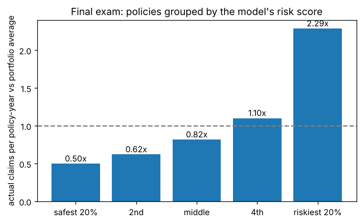

# Predicting car-insurance claim frequency (freMTPL2)

[](https://github.com/imtheeon/ml-pipeline-fremtpl2-claims/actions/workflows/tests.yml)

A 16-step, gated ML pipeline on 677,991 real French motor insurance policies. Poisson regression vs gradient boosting vs XGBoost 3.4.1. CPU only, $0.

## The question
How often will a policy have a claim? Insurers price on this, so the model predicts a claim **rate per policy-year** and multiplies by how long the policy runs. The score is Poisson deviance, the standard for claim counts.

## Headline result (final exam: 135,598 policies the models never saw, scored once)

| Model | Deviance (lower is better) | % better than charging everyone the average | Share of claims in riskiest 20% |
|---|---|---|---|
| Average rate (baseline) | 0.4788 | 0% | 20% (random) |
| Poisson regression | 0.4553 | 4.9% (4.4-5.3) | 35.2% |
| Gradient boosting | 0.4481 | 6.4% (5.9-6.9) | 38.8% |
| **XGBoost (selected)** | **0.4479** | **6.5% (5.9-7.0)** | **38.9%** |

Ranges are 95% bootstrap ranges.

- **Does it separate risk?** Yes. Grouping exam policies by the model's score, the riskiest 20% claim **2.3x** the average and the safest 20% claim **0.5x**, a 4.6x spread, and predicted rates match actual rates in every group.



## Honest caveats
- **XGBoost vs gradient boosting is a tie.** The gap (0.0002) is inside the error bars. XGBoost won on validation under a rule fixed before training; on the exam the two are indistinguishable. Both clearly beat Poisson regression.
- **The model gets policy length wrong.** Claims are 2.0x the prediction for policies under 5 weeks and 0.87x for near-full-year ones, because claim counts do not grow in proportion to time insured (policies often end after a claim). This is the first thing to fix (see `PIPELINE.md`, step 13 and the monitoring plan).
- **Frequency only.** No claim sizes and no calendar dates, so this is not a price and I could not test a future year.
- **Gains are modest, as expected.** Only 3.7% of policies have a claim; claims are noisy.

## Why you can trust the numbers
- Exposure (how long a policy runs) multiplies the predicted rate. It is never an input, because short policies often end after a claim and using it would leak the answer.
- Impossible values were capped, not deleted: exposure above 1 year (max 2.01), drivers and cars near 100 years old, up to 16 claims on one policy.
- The exam set is fingerprinted and scored once. The model choice, the tuning (cross-validation on train only) and the selection rule were all fixed before the exam.
- `pytest` checks the metrics, the exposure rule and that the README numbers match the saved result files.

## How this was built
I'm moving into data work from life and health insurance sales. I built this with Claude Code and approved each gate myself (data, split and metric, model choice, final exam) before it moved on. Every step, decision and chart explanation is logged in `ml_pipeline/PIPELINE.md`, and `INTERVIEW_GUIDE.md` explains the project in plain words.

## Run it
```bash
pip install -r requirements.txt
./run_all.sh      # downloads the data (9 MB) and runs steps 0-17; results land in ml_pipeline/
```
Data: `freMTPL2freq` from the CASdatasets collection (github.com/dutangc/CASdatasets), downloaded by `00_get_data.py`, not stored in this repo.

## Layout
- `ml_pipeline/00_get_data.py` ... `06_pricing_view.py`: the pipeline, in order
- `ml_pipeline/preprocess.py`, `models.py`, `metrics.py`: shared code
- `ml_pipeline/guard.py`: checks that block leakage and a second look at the exam set
- `ml_pipeline/figures/`: every chart
- `INTERVIEW_GUIDE.md`: this project explained in plain words

## More from me
- [ml-pipeline-pricing-promo](https://github.com/imtheeon/ml-pipeline-pricing-promo): the same pipeline on retail order data, predicting which discounted lines lose money
- [pricing-promo-analysis](https://github.com/imtheeon/pricing-promo-analysis): analysis and Streamlit dashboard on discounts and margin
